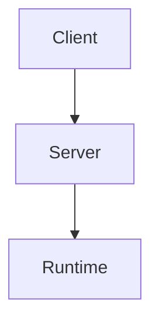

# DeepWiki Page Template

Use this template for each wiki page.

## 1) Summary

Write 2-4 sentences describing the page scope and why it matters.

## 2) Key Concepts

- List the main entities, modules, or concepts covered by this page.
- Keep each bullet short and concrete.

## 3) Detailed Sections

Use focused subsections based on the page topic. Typical patterns:

- Architecture: component boundaries, ownership, lifecycle.
- Protocol: request/response flow, notifications, state transitions.
- Workflow: setup, run, test, release commands.
- Troubleshooting: symptoms, likely causes, concrete fixes.

## 4) Diagrams (when applicable)

Prefer Mermaid for complex flows.



## 5) Relevant Source Files

List concrete repository paths used to produce this page.

- `path/to/file_a`
- `path/to/file_b`

## 6) Operational Commands (optional)

Include only runnable commands that are validated in the target repo.

```bash
# Example
pnpm test
```

